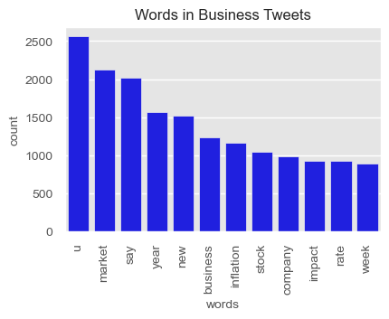

# Overview

The goal of this project is to create and deploy a model that can predict the primary interest of a Twitter user between the following four interests using the user's most recent tweets and NLP/predictive machine learning: Sports / Entertainment, Politics, Science / Technology, and Business. Also, if the user's primary interest is politics, a secondary goal was to to predict the user's political affiliation.

The purpose of this classification system is more successful targeted advertising and for a more enjoyable user experience.

# Business Understanding 

The stakeholder is Twitter itself, and I'm illustrating to Twitter the ability to use NLP/predictive machine learning on a user's tweets to better segment its users for the purpose of targeted advertising.  Having the ability to identify the primary interest of a user is invaluable for segmentation / targeted advertising.

# Data Understanding
For this analysis, I utilized ~136K tweets pulled from 612 Twitter accounts by me from the Twitter API. These accounts were manually selected by me to represent each account class that I am trying to predict. 

# Exploratory Data Analysis
The following top words were identified for each of the primary classifications in EDA:

## Business


## Politics


## Sports / Entertainment


## Science / Technology


# Modeling
The model created for the classification of users into the four primary segments is referred to as model 1. For model 1, I scaled down the population of political tweets used to train the model to a smaller dataset and separate file consisting of ~101K tweets.  Model 2 represents the secondary classfication of political users between conservative and liberal classes. For model 2, I utilized all political tweets from the complete dataset.

For both models, I used NLP techniques and predictive modeling. The first step was preprocessing the tweets.  I lowered the case of all words, got rid of stopwords and numeric words, and then tokenized and lemmatized the remaining words.  I then used a TFIDF vectorizor.  After that, I used a Complement Naive Bayes Classifier to fit, train, and then test how well the models predicted the primary interest and, if political, the political affiliation of the user.   

# Final Evaluation

Model 1 predicts the primary interest of a user with 98% accuracy. If the primary interest of the user is politics, the user's tweets are run through model 2, which predicts the political affiliation of the user with 95% accuracy.

These are very good results and should help Twitter improve its user segmentation and targeted advertising processes for a better user experience and better advertising metrics (clicks and conversions).

# Next Steps
Recommendation to Twitter for next steps: 
- Deploy the model at Twitter to better segment its users and improve targeted advertising.
- Run the model routinely on all its users, as interests change with people over time.

## For More Information   

See the full analysis in the [Jupyter Notebook](./notebook_01_main.ipynb) or review this [presentation](./presentation.pdf).

**For additional info, contact:**
- Nate Kist: natekist@outlook.com

## Repository Structure

```
├── images
│   ├── header.png
│   ├── business.png
│   ├── sportsenter.png
│   ├── politics.png
│   ├── sciencetech.png
├── data
│   ├── tweet_list.csv
│   ├── tweet_list2.csv
├── models
│   ├── model1_model.pkl
│   ├── model1_tfidf.pkl
│   ├── model2_model.pkl
│   ├── model2_tfidf.pkl
├── notebook_01_main.ipynb
├── notebook_02_data_collection.ipynb
├── notebook_03_eda.ipynb
├── notebook_04_deployment.ipynb
├── presentation.pdf
├── README.md
└── .gitignore
```


